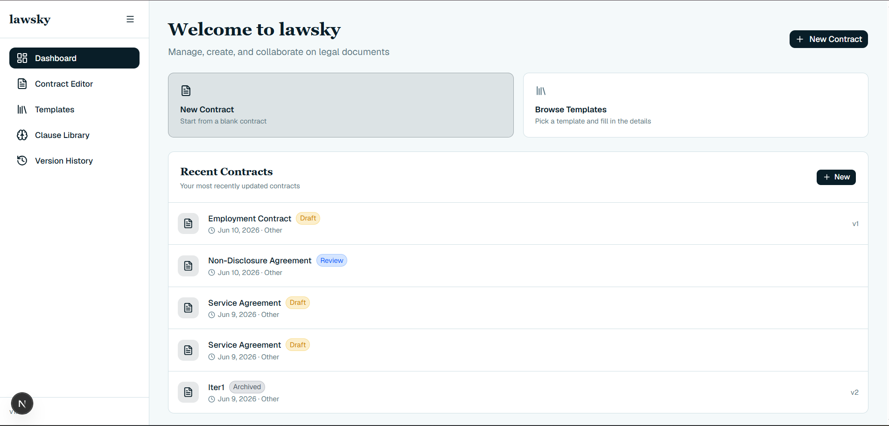
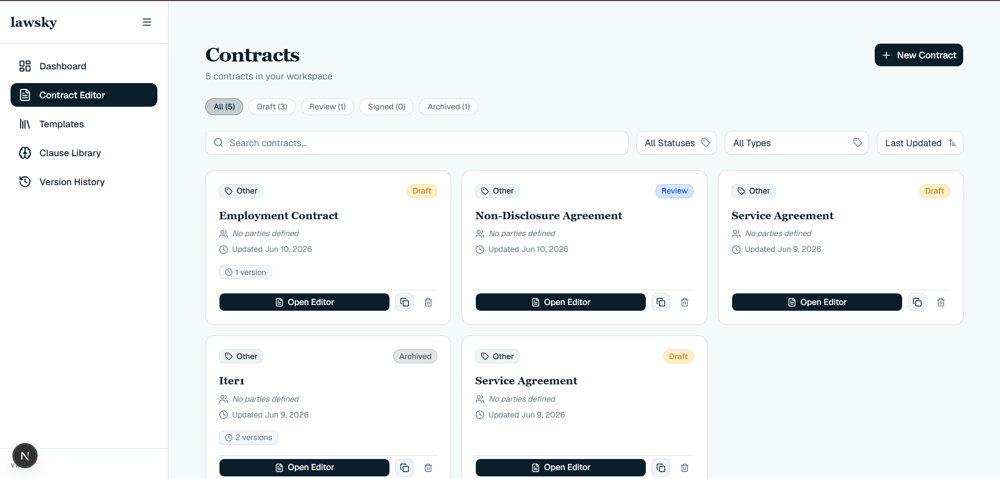
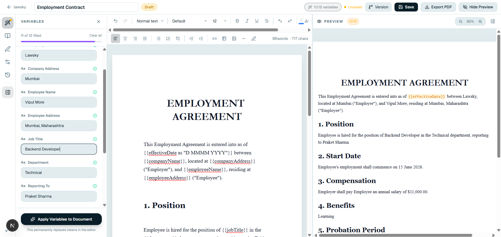
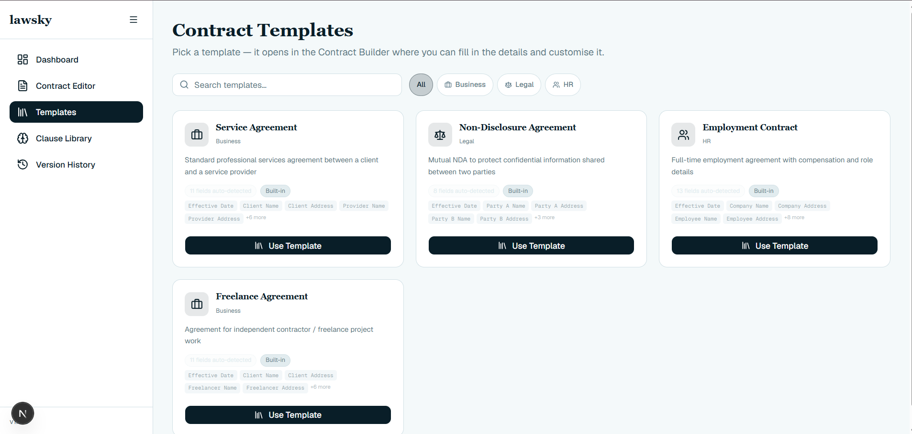
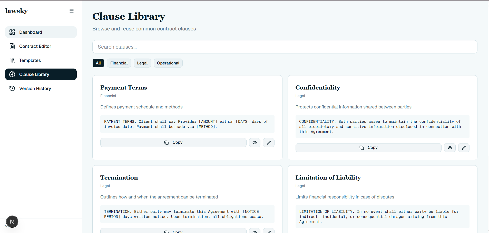

# Legal Contract Builder ⚖️

> A modern, powerful platform to manage, create, and collaborate on smart legal documents.

Legal Contract Builder is a comprehensive legal document management system that empowers users to build intelligent contracts using a rich text editor, predefined templates, reusable clause libraries, and advanced logic modeling.

---

## 🚀 Key Features

- **Intelligent Contract Builder**: Rich text editor (powered by Tiptap) with auto-detectable variables and syntax highlighting.
- **✨ AI Assistant (Gemini)**: Generate complete contracts from natural language prompts, automatically summarize complex clauses, and edit legal text conversationally inside the builder.
- **Template Engine**: Quick-start from predefined, customizable legal templates.
- **Clause Library**: Reusable clause snippets for fast document assembly and negotiation.
- **Version History**: Keep track of every change made to your documents over time.

---

## 📸 UI Images

**Home / Dashboard Feed**

<div align="center">

</div>

**Contract Builder / Editor**

<div align="center">

</div>
<div align="center">

</div>

**Template Selector**

<div align="center">

</div>

**Clause Library**

<div align="center">

</div>


## 🛠️ Tech Stack & Dependencies

- **Framework**: Next.js 14+ (App Router)
- **Language**: TypeScript
- **Styling**: Tailwind CSS & shadcn/ui
- **Rich Text Editor**: Tiptap (`@tiptap/react`, `@tiptap/starter-kit`)
- **AI Integration**: Google Gemini API (`@google/genai`)
- **Icons**: Lucide React
- **State/Storage**: Client-side LocalStorage architecture Just For MVP

---

## 📦 Prerequisites & Installation Steps

### Prerequisites
- **Node.js** (v18.x or higher)
- **npm**, **yarn**, **pnpm**, or **bun**
- **Google Gemini API Key** (for AI features)

### Installation

1. **Clone the repository:**
   ```bash
   git clone https://github.com/VipulMore11/Legal-test.git
   cd accord-project-update
   ```

2. **Install dependencies:**
   ```bash
   npm install
   # or
   pnpm install
   ```

3. **Configure Environment Variables:**
   Copy the example environment file and add your Gemini API key:
   ```bash
   cp .env.example .env
   ```
   Open `.env` and add your key: `GEMINI_API_KEY=your_api_key_here`

4. **Start the development server:**
   ```bash
   npm run dev
   # or
   pnpm dev
   ```

5. Open [http://localhost:3000](http://localhost:3000) with your browser to see the application.

---

## 🤝 Contribution Guide

We welcome contributions from the community! To get started:

1. **Fork the repository**
2. **Create your feature branch** (`git checkout -b feature/AmazingFeature`)
3. **Commit your changes** (`git commit -m 'Add some AmazingFeature'`)
4. **Push to the branch** (`git push origin feature/AmazingFeature`)
5. **Open a Pull Request** describing your changes in detail.

---
