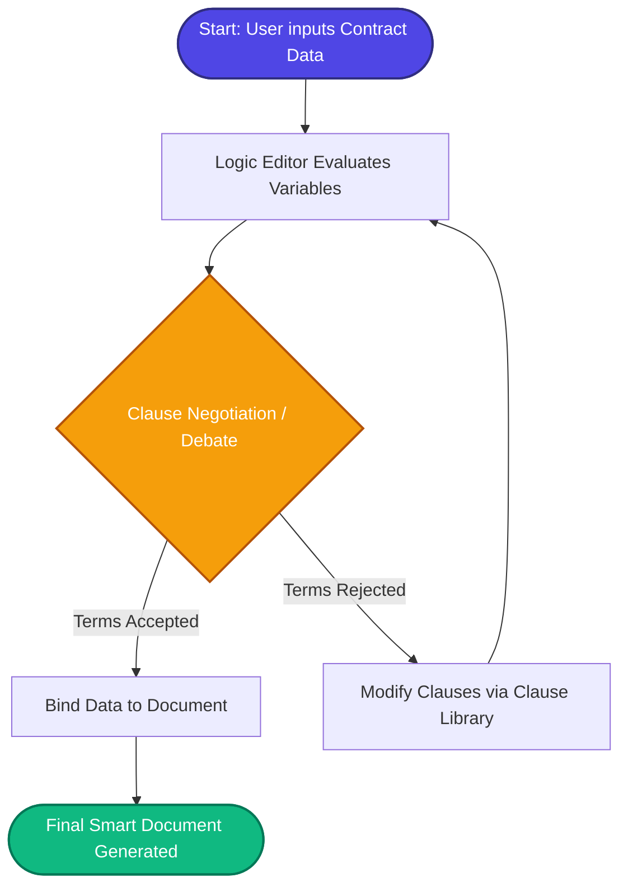

# Lawsky (Accord Project) ⚖️

> A modern, powerful platform to manage, create, and collaborate on smart legal documents.

Lawsky is a comprehensive legal document management system that empowers users to build intelligent contracts using a rich text editor, predefined templates, reusable clause libraries, and advanced logic modeling.

---

## 🚀 Key Features

- **Intelligent Contract Builder**: Rich text editor (powered by Tiptap) with auto-detectable variables and syntax highlighting.
- **Template Engine**: Quick-start from predefined, customizable legal templates.
- **Clause Library**: Reusable clause snippets for fast document assembly and negotiation.
- **Logic Editor**: Built-in Monaco editor for defining and evaluating advanced contract logic.
- **Version History**: Keep track of every change made to your documents over time.

---

## 🔄 Debate System (Logic & Clause Evaluation Flow)

The **Debate System** governs how contract terms are negotiated, logically evaluated, and bound to the document. Here is the start-to-end workflow of how it processes contract data:



---

## 🛠️ Tech Stack & Dependencies

- **Framework**: Next.js 14+ (App Router)
- **Language**: TypeScript
- **Styling**: Tailwind CSS & shadcn/ui
- **Rich Text Editor**: Tiptap (`@tiptap/react`, `@tiptap/starter-kit`)
- **Code/Logic Editor**: Monaco Editor (`@monaco-editor/react`)
- **Icons**: Lucide React
- **State/Storage**: Client-side LocalStorage architecture

---

## 📦 Prerequisites & Installation Steps

### Prerequisites
- **Node.js** (v18.x or higher)
- **npm**, **yarn**, **pnpm**, or **bun**

### Installation

1. **Clone the repository:**
   ```bash
   git clone https://github.com/VipulMore11/Legal-test.git
   cd accord-project-update
   ```

2. **Install dependencies:**
   ```bash
   npm install
   # or
   pnpm install
   ```

3. **Start the development server:**
   ```bash
   npm run dev
   # or
   pnpm dev
   ```

4. Open [http://localhost:3000](http://localhost:3000) with your browser to see the application.

---

## 💡 Usage Examples

### Creating a New Contract Programmatically
You can leverage the internal storage library to generate new smart contracts on the fly:

```typescript
import { createNewContract, saveContract } from "@/lib/storage";

// Generate a new contract instance
const contract = createNewContract("NDA Agreement - Tech Corp");

// Initialize empty Tiptap JSON content structure
contract.content = JSON.stringify({ type: "doc", content: [] });

// Save it to persistent local storage
saveContract(contract);
```

---

## 🔌 API Documentation

Lawsky currently runs on a client-side storage architecture without a traditional REST backend. Data management is handled via internal storage utilities interacting with the browser's `localStorage`.

### Core Storage API (`@/lib/storage.ts`)

| Function | Description | Returns |
|----------|-------------|---------|
| `createNewContract(title?: string)` | Initializes a new contract object with a unique ID and timestamp. | `Contract` |
| `saveContract(contract: Contract)` | Persists the given contract object to local storage. | `void` |
| `getContract(id: string)` | Retrieves a specific contract by its unique ID. | `Contract | null` |
| `getAllContracts()` | Returns an array of all saved contracts. | `Contract[]` |
| `deleteContract(id: string)` | Removes a contract from local storage. | `void` |

---

## 📂 Project Structure Overview

```text
accord-project-update/
├── app/                  # Next.js App Router (Pages & Layouts)
│   ├── builder/          # Dynamic route for the Contract Builder Editor
│   └── page.tsx          # Main Dashboard & Navigation Entry
├── components/           # React Components
│   ├── builder/          # Contract editor UI and toolbars
│   ├── clauses/          # Clause library components
│   ├── contracts/        # Contract list, picker, and version history
│   ├── logic-editor/     # Monaco-based logic editor
│   ├── templates/        # Template selector UI
│   └── ui/               # Reusable shadcn/ui components
├── lib/                  # Utility functions (Storage, Template Engine)
├── types/                # TypeScript interfaces (Contract, Template, etc.)
└── public/               # Static frontend assets
```

---

## 🤝 Contribution Guide

We welcome contributions from the community! To get started:

1. **Fork the repository**
2. **Create your feature branch** (`git checkout -b feature/AmazingFeature`)
3. **Commit your changes** (`git commit -m 'Add some AmazingFeature'`)
4. **Push to the branch** (`git push origin feature/AmazingFeature`)
5. **Open a Pull Request** describing your changes in detail.

## 📄 License

This project is distributed under the MIT License. See the `LICENSE` file for more information.

---

## 📸 UI Screenshots

Use these placeholders to drop in screenshots or mockups. Screens are based on frontend routes and components.

**Home / Dashboard Feed**

<div align="center">

</div>

**Contract Builder / Editor**

<div align="center">

</div>

**Template Selector**

<div align="center">

</div>

**Clause Library**

<div align="center">

</div>
